<div align="center">

<a href="https://kncn23.github.io"></a>

# kncn23.github.io

**Personal portfolio of [Ata Kaan Can Olcay](https://github.com/KNCn23)** — Computer Engineering @ Başkent University
Embedded systems · Edge AI · Systems programming · Optimization

[](https://kncn23.github.io)
[](https://github.com/KNCn23/KNCn23.github.io/deployments)
[](#-structure)
[](#-running-locally)

**[Visit the site →](https://kncn23.github.io)**

</div>

---

## ✨ Highlights

- 🌐 **Bilingual (EN / TR)** — language switcher with browser-language auto-detection, choice persisted in `localStorage`
- 🎨 **Hand-crafted dark design** — pure HTML/CSS/JS; no frameworks, no build step, zero dependencies
- ⭐ **Live GitHub data** — star counts and repo stats fetched from the GitHub API at runtime; degrades gracefully when offline or rate-limited
- 🗂️ **Filterable project grid** — Embedded & Systems · AI & ML · Security & Crypto · Optimization · Web & Backend · Games
- 🧵 **Scroll spine & rail** — animated SVG path that follows your reading progress through the page
- 🔍 **SEO-ready** — sitemap, robots.txt, Open Graph card, semantic markup

## 🎨 Design language

The whole site runs on a small set of CSS custom properties:

| | Token | Hex | Role |
|---|---|---|---|
|  | `--bg` | `#0a0e14` | Page background |
|  | `--bg-card` | `#121a28` | Cards & panels |
|  | `--border` | `#1f2a3c` | Hairlines & borders |
|  | `--text` | `#d6e2f0` | Body text |
|  | `--text-dim` | `#8b9bb4` | Secondary text |
|  | `--accent` | `#58e6d9` | Primary accent (teal) |
|  | `--accent-2` | `#7c8cff` | Secondary accent (periwinkle) |

**Typography:** [Inter](https://fonts.google.com/specimen/Inter) for UI · [JetBrains Mono](https://fonts.google.com/specimen/JetBrains+Mono) for code and accents

## 🗂️ Structure

```
.
├── index.html             # single-page layout — all sections
├── assets/
│   ├── style.css          # design tokens + all styles
│   ├── script.js          # i18n dictionary, project data, filters, GitHub API, scroll spine
│   ├── og-image.png       # social preview card
│   └── cv/                # downloadable CV (PDF)
├── robots.txt
└── sitemap.xml
```

Everything is data-driven from [`assets/script.js`](assets/script.js): the `I18N` dictionary holds every string in both languages, and `FEATURED` / `PROJECTS` arrays feed the project cards — adding a project is a single array entry.

## 🚀 Running locally

No build step — clone and serve:

```bash
git clone https://github.com/KNCn23/KNCn23.github.io.git
cd KNCn23.github.io
python3 -m http.server 8000   # → http://localhost:8000
```

…or just open `index.html` in a browser.

## 📬 Contact

<div align="center">

[**GitHub**](https://github.com/KNCn23) · [**LinkedIn**](https://www.linkedin.com/in/ata-kaan-can-olcay-0154a2208/) · [**CV**](assets/cv/Ata-Kaan-Can-Olcay-CV.pdf)

<sub>Built with plain HTML, CSS and JS — no frameworks were harmed in the making of this site.</sub>

</div>
